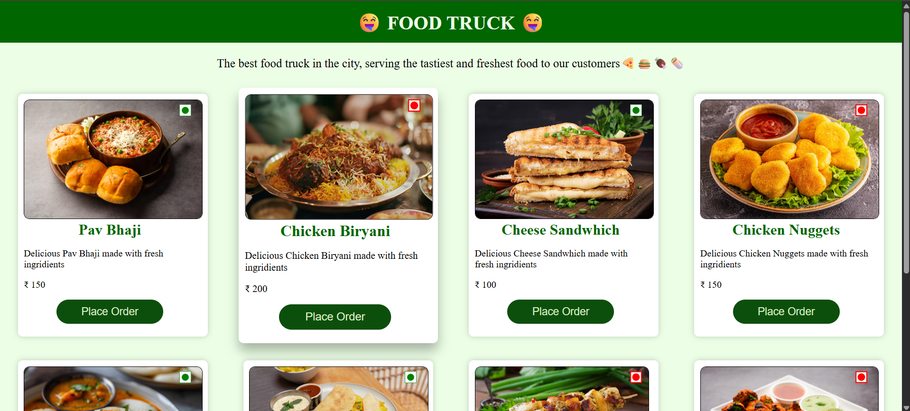

# 🚚 Food Truck - Configurable UI Project



Welcome to the **Food Truck** project! This is a React-based application built to explore and understand how to create a **configurable UI** using **React** and **CSS**.

## 🧾 Project Overview

This project displays a stylish, responsive UI for a fictional food truck menu. Users can see various food items presented in neatly styled cards, with visual indicators like veg/non-veg icons, prices, and descriptions. The main goal is to learn how to build **modular**, **reusable**, and **configurable** UI components using real-world design patterns.

---

## 🛠 Tech Stack

- ⚛️ **React** – for component-based development
- 🎨 **CSS** – for styling and layout


---

## 🎯 Purpose

The key focus of this project is to:

- Understand the structure of configurable UI components.
- Practice working with dynamic props like `title`, `description`, `price`, `isVeg`, and `imgUrl`.


---


## 🚀 Getting Started

1. Clone this repository:
   ```bash
   git clone https://github.com/sejalsharmas/Food-truck
